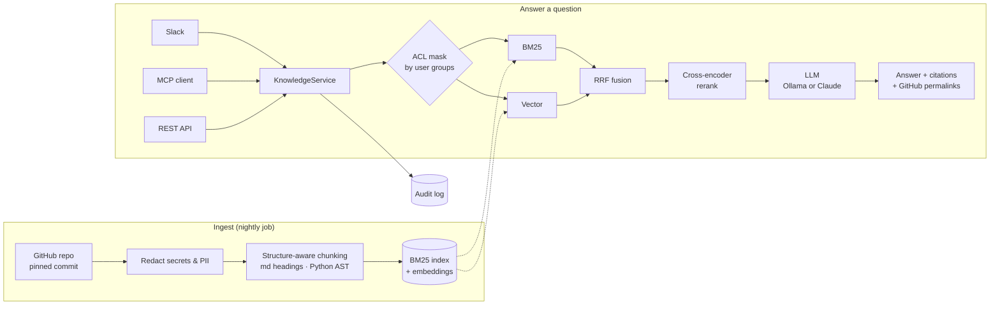

<div align="center">

# kb-assistant

**A permission-aware RAG assistant for your GitHub docs and code. It works as an MCP server and a Slack bot, and every claim about it is measured.**


</div>

> 🇹🇷 **Özet:** Şirket içi bilgi asistanı. GitHub reposundaki dokümanları ve kodu indeksler.
> Hibrit arama (BM25 + vektör) ve reranking ile ilgili parçaları bulur. Kaynak gösteren,
> uydurmayan cevaplar üretir. Bunu **MCP sunucusu** ve **Slack botu** olarak sunar. Yetki
> kontrolü, PII redaksiyonu ve audit log içerir. 49 soruluk bir eval seti ile retrieval
> doğruluğunu, halüsinasyon oranını, gecikmeyi ve maliyeti ölçer. Türkçe soruları da
> İngilizce dokümanlarda bulabilir.

---

## At a glance

| | |
|---|---|
| 🎯 **Retrieval** | **93% Hit@5, 0.87 MRR** on 45 hand-written questions; Hit@1 rose from 0.56 to 0.82 with reranking |
| 🇹🇷 **Turkish → English** | Turkish questions over English docs: Hit@5 rose from **0.17 to 0.83** after an embedding + reranker ablation |
| 🛡️ **Abstention** | **4/4** questions the corpus can't answer were declined, with nothing invented |
| 🔒 **Security** | ACLs enforced *inside* retrieval, secrets and PII redacted before indexing, a JSONL audit log of who saw what |
| 💸 **Cost** | **$0 per query** with a local LLM (Ollama). Claude is one setting away |
| 🔌 **Interfaces** | MCP server · Slack bot · REST API · CLI. All of them run through one code path |
| ✅ **CI** | Every PR rebuilds the index and **fails if retrieval quality drops** |

The demo corpus is [`encode/httpx`](https://github.com/encode/httpx) pinned at `b5addb64`:
52 files of Markdown docs and Python source, standing in for an internal repo. To index
your own repo, edit `config/settings.yaml`.

## How it works



**Example:** a Turkish question answered from English docs, by the local 3B model, at $0
(from the eval run):

> **Q:** HTTP/2 desteğini nasıl açarım?
>
> **A:** HTTP/2 desteğini açmak için, `httpx` client'inizde HTTP/2 desteği etkinleştirmeniz
> gerekmektedir. Bu, `pip install httpx[http2]` komutunu kullanarak `httpx` paketini
> güncellemeniz ve ardından `http2=True` parametresiyle bir `AsyncClient` veya `Client`
> nesnesi oluşturmanız gerekmektedir. […]

## Quickstart

```bash
python -m venv .venv && source .venv/bin/activate     # Windows: .venv\Scripts\activate
pip install -e ".[dev]"
python -m kbassist.cli index                          # clone at pinned commit, chunk, embed (~3 min, CPU)
python -m kbassist.cli search "how do I make httpx ignore HTTP_PROXY"

ollama pull qwen2.5:3b                                # free local LLM (default provider)
python -m kbassist.cli ask "httpx'te varsayılan timeout nedir?"
```

To use Claude instead, set `ANTHROPIC_API_KEY` and `KB_LLM__PROVIDER=anthropic`.

---

## Results

Every number below comes from `eval/run_eval.py` and is written into this README by
`python eval/run_eval.py report`. Nothing is typed in by hand.

### The eval set

[`eval/questions.yaml`](eval/questions.yaml) holds **49 questions**, written by hand
against the pinned commit and phrased the way people actually ask in Slack:

| Slice | n | What it tests |
|---|---:|---|
| Docs | 27 | How-to questions answered by `docs/**` |
| Code | 12 | Answers that only exist in source, e.g. redirect method rewriting or the digest-auth `cnonce` |
| Turkish | 6 | Turkish questions over an English corpus |
| Unanswerable | 4 | Company questions (on-call policy, SLOs) that the bot must decline |

Each question has gold file paths, used for retrieval scoring, and reference facts, used
for answer grading. One question has a false premise: it asks how to set the TTL of a
cache that httpx doesn't have.

### 1 · Retrieval: does the right file reach the LLM?

<!-- BEGIN:retrieval -->
Embedding `sentence-transformers/paraphrase-multilingual-MiniLM-L12-v2` · reranker `jinaai/jina-reranker-v2-base-multilingual` · 45 answerable questions · 776 chunks

| Retrieval mode | Hit@1 | Hit@3 | Hit@5 | Recall@5 | MRR@10 | p50 latency | p95 latency |
|---|---:|---:|---:|---:|---:|---:|---:|
| BM25 only | 0.556 | 0.733 | 0.822 | 0.752 | 0.668 | 0.1 ms | 0.2 ms |
| Vector only | 0.511 | 0.644 | 0.689 | 0.630 | 0.589 | 5.8 ms | 7.3 ms |
| Hybrid (BM25 + vector, RRF) | 0.556 | 0.800 | 0.844 | 0.778 | 0.672 | 5.8 ms | 8.1 ms |
| Hybrid + cross-encoder rerank | 0.822 | 0.911 | 0.933 | 0.852 | 0.869 | 2,791 ms | 3,109 ms |
<!-- END:retrieval -->

<sub>Hit@k: at least one gold file is in the top-k chunks. Recall@5: the fraction of gold
files found in the top 5. Latency is measured warm on a laptop CPU with no GPU.</sub>

<details>
<summary><b>Breakdown by slice</b> (code vs. docs, English vs. Turkish)</summary>

<!-- BEGIN:breakdown -->
| Slice | n | BM25 only Hit@5 | Vector only Hit@5 | Hybrid (BM25 + vector, RRF) Hit@5 | Hybrid + cross-encoder rerank Hit@5 |
|---|---:|---:|---:|---:|---:|
| category: code | 13 | 0.923 | 0.615 | 1.000 | 1.000 |
| category: doc | 32 | 0.781 | 0.719 | 0.781 | 0.906 |
| lang: en | 39 | 0.872 | 0.718 | 0.872 | 0.949 |
| lang: tr | 6 | 0.500 | 0.500 | 0.667 | 0.833 |
<!-- END:breakdown -->

</details>

### 2 · How the models were chosen (ablation)

<!-- BEGIN:ablation -->
| Embedding model | Reranker | Vector Hit@5 | Hybrid Hit@5 | Hybrid+rerank Hit@5 | Hybrid+rerank MRR@10 | Turkish Hit@5 (hybrid / +rerank) | Hybrid+rerank p50 |
|---|---|---:|---:|---:|---:|---:|---:|
| `BAAI/bge-small-en-v1.5` | `Xenova/ms-marco-MiniLM-L-12-v2` (pool 20) | 0.733 | 0.889 | 0.844 | 0.718 | 0.500 / 0.167 | 2,774 ms |
| `BAAI/bge-small-en-v1.5` | `jinaai/jina-reranker-v2-base-multilingual` (pool 20) | – | 0.889 | 0.911 | 0.798 | 0.500 / 0.500 | 9,911 ms |
| `sentence-transformers/paraphrase-multilingual-MiniLM-L12-v2` | `jinaai/jina-reranker-v2-base-multilingual` (pool 20) | 0.689 | 0.844 | 0.978 | 0.885 | 0.667 / 1.000 | 10,186 ms |
| `sentence-transformers/paraphrase-multilingual-MiniLM-L12-v2` | `jinaai/jina-reranker-v2-base-multilingual` (pool 20, 600 chars) | – | – | 0.956 | 0.847 | – / 1.000 | 3,639 ms |
| **chosen** `sentence-transformers/paraphrase-multilingual-MiniLM-L12-v2` | `jinaai/jina-reranker-v2-base-multilingual` (pool 10, 1000 chars) | 0.689 | 0.844 | 0.933 | 0.869 | 0.667 / 0.833 | 2,791 ms |
<!-- END:ablation -->

**What I learned, in the order I ran the experiments:**

1. **The popular reranker made results worse.** `ms-marco-MiniLM` dropped Hit@5 from 0.889
   to 0.844 and Turkish from 0.50 to 0.17. It was trained on English web passages, not on
   code or Turkish. *A reranker has to be measured on your own corpus before you trust it.*
2. **A code-aware multilingual reranker fixed the ordering** (MRR 0.72 → 0.80). Turkish
   stayed at 0.50, because the right chunks never reached the candidate pool.
3. **A multilingual embedding model is worse on its own but better in the pipeline.**
   Vector Hit@5 fell from 0.73 to 0.69, but Turkish candidates now reached the reranker:
   overall Hit@5 rose to **0.978**, and Turkish to **1.00**. Picking each component on its
   own would have chosen the wrong embedding model.
4. **Latency tuning.** That setup needed about 10 s p50 on CPU. Reranking 10 candidates
   instead of 20, truncated to 1,000 chars, brought it to **2.8 s p50 (p95 14 s → 3.1 s)**
   for a loss of 0.016 MRR. That is the shipped default.

<sub>Caveats: there are 45 answerable questions and only 6 are Turkish, so one question
moves that column by 0.17. Gold labels are file-level and strict. Some "misses" retrieved
the implementing source file where the label expected the docs page, and I didn't relabel
them after seeing the results.</sub>

### 3 · Generation: accuracy, hallucination, latency, cost

<!-- BEGIN:generation -->
Generator `qwen2.5:3b` (local via Ollama, CPU only), judge `qwen2.5:3b`, n = 49; second-pass labels: `eval/results/audit.yaml` (claude-opus-5-5 (dev session, not human))

| Quality metric | Local 3B judge (automatic) | Second-pass review |
|---|---:|---:|
| Answer accuracy (correct = 1, partial = 0.5) | 80.0% | 63.3% |
| Strictly correct answers | 77.8% | 55.6% |
| **Hallucination rate** (answers with a claim not supported by the sources) | 16.2% | 16.2% |
| Declines unanswerable questions (higher is better) | 100.0% | 100.0% |
| False "not in the sources" on answerable questions (lower is better) | 17.8% | 11.1% |
| Judge agrees with review: correctness / hallucination flag | 69.4% / 83.8% | |

| Operational metric | Value |
|---|---:|
| Answers citing a gold file | 89.2% |
| End-to-end latency p50 / p95 | 37,443 ms / 51,306 ms |
|   of which retrieval p50 | 2,755 ms |
|   of which LLM p50 / p95 | 34,679 ms / 48,342 ms |
| Mean tokens in / out | 1,666 / 85 |
| **Cost per query** / per 1k queries | $0.0000 / $0.00 |
<!-- END:generation -->

**What I learned:**

1. **The judge needs evaluating too.** A 3B judge agreed with a careful second review on
   only 69% of verdicts, and it was lenient. It accepted a claim that the Authorization
   header survives cross-domain redirects (the code strips it). Accuracy fell from 80% to
   **63%** once those cases were caught. In production I'd use a stronger judge and keep a
   human-labelled sample.
2. **The bottleneck is the generator, not retrieval.** In 17 of 20 imperfect answers the
   right file *was* in the context. The 3B model misread it, or said "not in the sources".
   A stronger model is one setting away (`KB_LLM__PROVIDER=anthropic`).
3. **Abstention works:** all 4 unanswerable company questions were declined, and nothing
   was invented for them.
4. **The eval caught a product bug.** In JSON mode the small model sometimes writes "here's
   an example:" and then ends without the code block. The fix is to generate prose first
   and extract citations separately.
5. **37 s p50 is fine for an offline demo, not for Slack.** Interactive use needs a GPU or
   a hosted model.

<details>
<summary><b>How generation is measured</b></summary>

- **Hallucination** means a claim that the *retrieved sources* don't support. A judge
  splits each answer into atomic claims and checks every one against the exact sources
  the generator saw ([`eval/judge.py`](eval/judge.py)).
- **Accuracy** is graded against the hand-written reference facts.
- **Abstention** is measured both ways: the bot should decline unanswerable questions,
  and should not decline answerable ones.
- **Cost** comes from the model's reported token usage × the price table in
  `config/settings.yaml`. Retrieval runs locally, so the LLM is the only per-query cost.
- **Second-pass review:** every answer was also labelled against the references and the
  source code ([`eval/results/audit.yaml`](eval/results/audit.yaml)) to measure how far
  the automatic judge can be trusted. A stronger model wrote those labels during
  development, not a human, and the file says so.

</details>

---

## Design decisions

| Decision | Why | Trade-off |
|---|---|---|
| **Hybrid BM25 + dense, fused with RRF** | BM25 nails exact identifiers (`trust_env`, `DEFAULT_MAX_REDIRECTS`). Dense retrieval catches paraphrases. RRF needs no score calibration | Two retrievers to maintain |
| **Cross-encoder rerank (top 10, 1,000 chars)** | The biggest single gain: Hit@1 0.56 → 0.82 | About 2.8 s on CPU. Tuned in the ablation |
| **Code-aware tokenizer** | Indexes `max_keepalive_connections` whole *and* split into words | Slightly larger index |
| **Structure-aware chunking** | Markdown is split by heading, with a breadcrumb (`Timeouts > Fine tuning`). Python is split per function/class via `ast` | Language-specific code |
| **Local ONNX models** (fastembed) | Source code never leaves the network to be embedded, and indexing is free | Reranking on CPU is slow |
| **numpy, not a vector DB** | About 800 chunks: exact search takes about 1 ms with perfect recall | Swap to Qdrant/pgvector at scale; it's one function |
| **ACLs inside retrieval** | Restricted chunks are masked *before* ranking, so they can't reach the prompt, citations or MCP tools | A mask per group set |
| **Redact before indexing** | Tokens, keys, cards, TCKN, IBAN, emails and phone numbers are never embedded or stored. Checksums keep false positives low | Redacted text isn't searchable, which is intended |
| **Structured output** | `answerable / answer / citations` make abstention and citations machine-checkable | – |
| **Untrusted-source framing** | Retrieved text goes inside `<source>` tags and is treated as data. This defends against prompt injection hidden in repo content | – |
| **Pluggable LLM** | Ollama runs offline at $0. Claude gives higher quality. The same schema works on both | A local 3B model is weaker, and the eval measures how much |

## Security & governance

- **Permission-aware retrieval.** [`config/acl.yaml`](config/acl.yaml) maps path globs and
  users to groups. In production, groups come from the IdP and are keyed on the Slack
  user's verified email. A test checks that a restricted chunk can't be retrieved even
  when it's the best lexical match.
- **Audit log.** Every search, answer, document read, denied access and 👍/👎 becomes one
  JSONL record: the user, their groups, the chunks shown and cited, latency per stage,
  tokens and cost. Questions are stored redacted. Answers are stored as a hash.
- **Secrets.** Tokens come only from env vars or k8s Secrets. `GITHUB_TOKEN` is sent as an
  HTTP header and never stored in git config. Containers run as non-root, and egress is
  limited by a NetworkPolicy.

## Interfaces

<details open>
<summary><b>Slack bot</b></summary>

Mention `@kb` in a channel or DM it. It replies in a thread with the answer, links to the
cited sources (GitHub permalinks to the exact commit and lines), and 👍/👎 buttons that
feed an online quality signal into the audit log. It uses Socket Mode, so no public
ingress is needed. The app manifest is in
[`deploy/slack-manifest.yaml`](deploy/slack-manifest.yaml).

```bash
python -m kbassist.slack_app      # needs SLACK_BOT_TOKEN and SLACK_APP_TOKEN
```
</details>

<details open>
<summary><b>MCP server</b></summary>

| Tool | Purpose |
|---|---|
| `search_knowledge_base(query, k)` | Hybrid + rerank search; returns chunks with permalinks |
| `read_file(path, start_line, end_line)` | Reads more context around a hit, with ACL checks |
| `ask_knowledge_base(question)` | One-shot grounded answer with citations |
| `list_sources()` | Indexed repos, pinned commits, index stats |

```bash
claude mcp add kb -- python -m kbassist.mcp_server     # use it from Claude Code
python -m kbassist.mcp_server --http 8765              # or serve it over streamable HTTP
python scripts/mcp_smoke_test.py                       # end-to-end check with a real MCP client
```
</details>

<details>
<summary><b>REST API, Docker, Kubernetes</b></summary>

```bash
uvicorn kbassist.api:app --port 8080       # /search  /ask  /documents/{path}  /healthz  /readyz
docker compose --profile jobs run --rm indexer && docker compose up api slack
kubectl apply -f deploy/k8s/               # nightly index CronJob + api/slack Deployments
```
</details>

## Running the evals

```bash
pytest -q                                  # 17 unit tests, no network or API key
python eval/run_eval.py retrieval          # retrieval metrics, free
python eval/run_eval.py generate           # answers + LLM judge (Ollama by default)
python eval/run_eval.py report             # refresh the tables in this README
python eval/run_eval.py gate --min-hit5 0.85 --min-mrr 0.65    # what CI runs
```

**CI** ([`.github/workflows/ci.yml`](.github/workflows/ci.yml)) runs unit tests, then an
index build at the pinned commit, then the retrieval eval, then a **quality gate** that
fails the PR if Hit@5 or MRR regress. The LLM eval runs only on manual dispatch.

## Project layout

```
src/kbassist/
├── ingest/         github.py (pinned clone) · chunking.py (md headings / Python AST)
├── index/          bm25.py · embeddings.py (fastembed) · store.py
├── security/       acl.py · pii.py · audit.py
├── retrieval.py    BM25 + vector + RRF + rerank, ACL-masked
├── generation.py   grounded answers, citations, refusal handling
├── llm.py          OllamaLLM (local) · AnthropicLLM (Claude)
├── service.py      the one code path behind CLI / MCP / Slack / API
└── mcp_server.py · slack_app.py · api.py · cli.py · observability.py
eval/               questions.yaml · run_eval.py · judge.py · results/
deploy/             k8s manifests · Slack app manifest
```

## Roadmap

- [ ] **Stronger generator and judge.** Run the same eval with Claude and put the
      local and hosted results side by side
- [ ] **Query translation for BM25.** Turkish BM25 Hit@5 is still 0.50, and an English
      rewrite of non-English queries should lift it
- [ ] **Reranker on a GPU** to bring back the 20-candidate pool (Hit@5 0.978)
- [ ] **Incremental indexing** from GitHub push webhooks (chunk ids are already content hashes)
- [ ] **Online eval loop:** feed 👎 answers from the audit log back into the eval set
- [ ] **OpenTelemetry export** of the existing trace spans

## License

MIT
